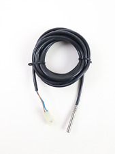
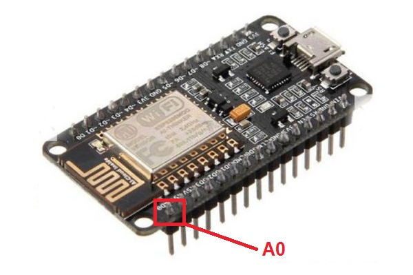
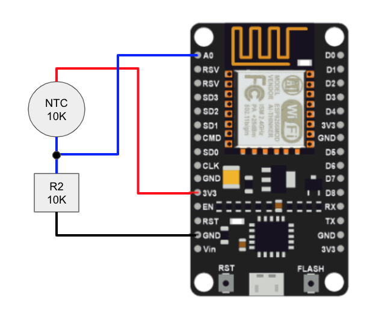

# ESP32/ESP8266 + Viessmann NTC 10K Termistor Water Sensor

The Viessmann NTC 10k Termistor 7181301 represents a classic sensor for water temperature of all kinds, mostly used for solar water buffers.



The NTC 10k termistor is a 10K temperature dependent resistor with 2 wires that can be read from Arduino or ESP8266 by using a voltage divider circuit, 
using a resistor of the same resistance 10k as the termistor has.
The 10k resistor to use shows the colors brown/black/orange, as it is shown below:


In order to get an analog readout on for the voltage of your voltage divider you need to choose an analog input pin on your ESP8266 as shown below:



Now connect the NTC 10k Viessmann NTC termistor to one of the 3V and ground pins of your ESP8266 and connect the 10k resistor divided middle connection to your analog pin, as shown below:


The last part is to use the following Arduino code to read out the scaled voltage value from the analog pin and to calculate the temperature value from it.

```java
// Water temperatur Viessmann NTC 10K Termistor Sensor 
// Needs to connect to one of the ESP32 or ESP8866 analog input pins like A0
int TERMISTORPIN = A0;

float readTermistorValue() {
  int Vo;
  float R1 = 10000; // 10K Ohm Termistor
  float logR2, R2, T, Tc;
  float c1 = 1.009249522e-03, c2 = 2.378405444e-04, c3 = 2.019202697e-07;

  Vo = analogRead(TERMISTORPIN);
  Serial.print(Vo / 1023.0);
  Serial.println(" V");   
  
  R2 = R1 * (1023.0 / (float)Vo - 1.0);
  logR2 = log(R2);
  T = (1.0 / (c1 + c2*logR2 + c3*logR2*logR2*logR2));
  Tc = T - 273.15; 

  Serial.print(Tc);
  Serial.println(" C");   
  return Tc;
}
```
