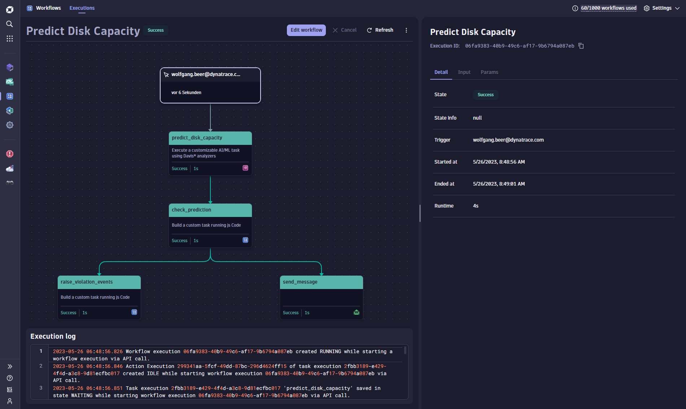

# Example Dynatrace Workflow for Predictive Disk Capacity Management

This example shows a Dynatrace workflow that uses Davis forecasts on disk capacity to anticipate
future capacity shortage and to trigger remediation actions.

- Check forecast result [TypeScript code](check_prediction_ts_action.js)
- Raise alarm events [TypeScript code](raise_violation_events_ts_action.js)

