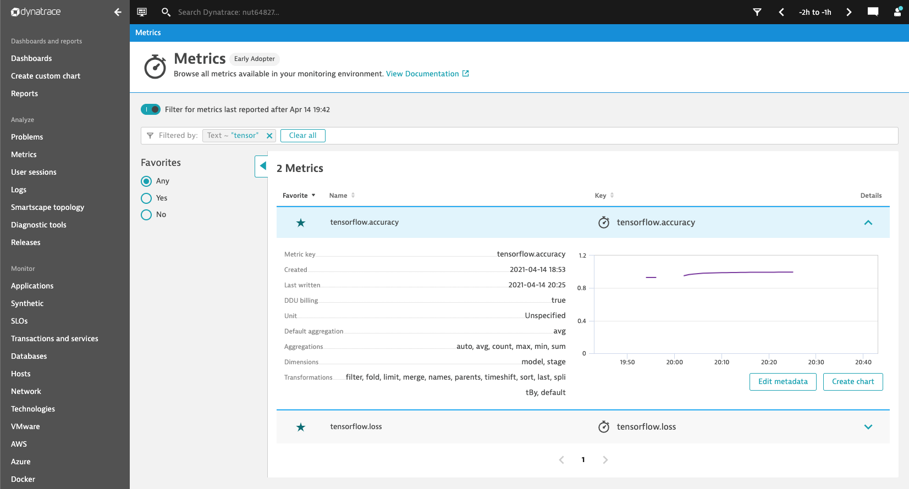
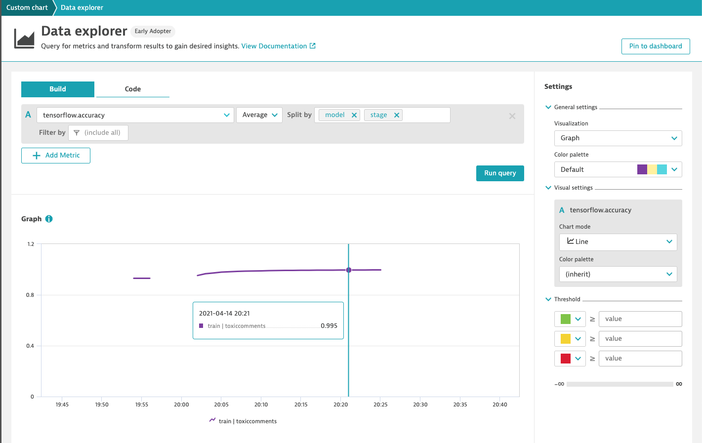

# TensorFlow Keras Callback Class for Dynatrace Monitoring

This simple TensorFlow Keras callback class is intended to collect AI model metrics
during the model training, testing and prediction stages and send those to your 
Dynatrace monitoring environment.

Usage is:
``` { .python }
dt_callback = DynatraceKerasCallback(metricprefix='tensorflow', modelname='toxiccomment', url='https://your.live.dynatrace.com/api/v2/metrics/ingest', apitoken='yoursecret')

model.fit(
    x=train_texts, y=target,
    epochs=100,
    callbacks=[dt_callback],
    )
```

Find all the TensorFlow reported metrics within your Dynatrace metric browser, as shown below:



Now you can chart your models performance within a dashboard.


