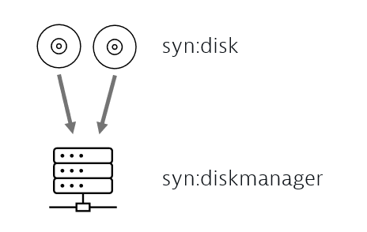
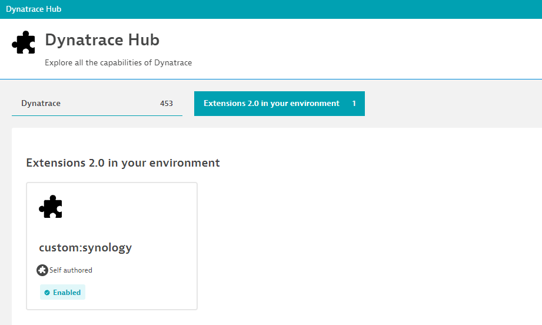
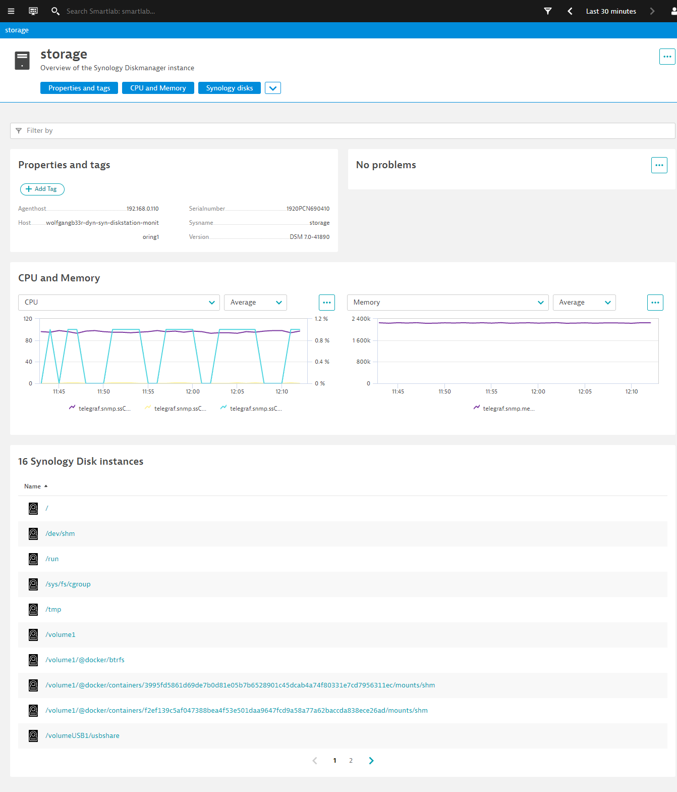

# Synology Diskstation topology extraction example

This self-contained example explains how to set up topology extraction configurations that automatically identify a monitored Synology Diskstation and its mapped network drives.

This example contains:

- A [load generator](diskstation-demo-datagenerator.py) that sends simulated/random Synology Disk metrics.
- A [Dynatrace Extension 2.0 yaml](extension.yaml) file that contains all necessary declarative extraction rules to generate a dynamic topology, as it is shown below.

## Topology definition



## Dynatrace Extension 2.0

To simplify the creation of those 3 different entity types along with their relationships, the newly introduced [Dynatrace Extension 2.0 framework](https://www.dynatrace.com/support/help/extend-dynatrace/extensions20/) can be used.

- First install the [Dynatrace CLI](https://github.com/dynatrace-oss/dt-cli) to build and sign the extension.
- pip install dt-cli
- dt extension gencerts
- dt extension build
- upload it into your Dynatrace Hub, as shown below:



## Load generator

A self-contained Python script that sends metrics with random measurements into your Dynatrace monitoring environment.

### How to run the load generator

- Replace the API token with your own Dynatrace APIv2 access token that has the metric ingest scope enabled.
- Replace the Dynatrace API URL with your own monitoring environment domain.
- Start the load generator with python3 ./diskstation-demo-datagenerator.py

See below an example of the raw dimensional metric line protocol that the load generator generates and sends every minute:

```text
telegraf.snmp.ssCpuUser,agent_host="192.168.0.110",host="wolfgangb33r-dyn-syn-diskstation-monitoring1",modelname="DS218+",serialnumber="1920PCN690410",sysname="storage",version="DSM 7.0-41890" 1
telegraf.snmp.memTotalSwap,agent_host="192.168.0.110",host="wolfgangb33r-dyn-syn-diskstation-monitoring1",modelname="DS218+",serialnumber="1920PCN690410",sysname="storage",version="DSM 7.0-41890" 3221428
telegraf.snmp.memAvailSwap,agent_host="192.168.0.110",host="wolfgangb33r-dyn-syn-diskstation-monitoring1",modelname="DS218+",serialnumber="1920PCN690410",sysname="storage",version="DSM 7.0-41890" 2329228
telegraf.snmp.memTotalReal,agent_host="192.168.0.110",host="wolfgangb33r-dyn-syn-diskstation-monitoring1",modelname="DS218+",serialnumber="1920PCN690410",sysname="storage",version="DSM 7.0-41890" 1871684
telegraf.snmp.temperature,agent_host="192.168.0.110",host="wolfgangb33r-dyn-syn-diskstation-monitoring1",modelname="DS218+",serialnumber="1920PCN690410",sysname="storage",version="DSM 7.0-41890" 40
telegraf.snmp.powerStatus,agent_host="192.168.0.110",host="wolfgangb33r-dyn-syn-diskstation-monitoring1",modelname="DS218+",serialnumber="1920PCN690410",sysname="storage",version="DSM 7.0-41890" 1
telegraf.snmp.memTotalFree,agent_host="192.168.0.110",host="wolfgangb33r-dyn-syn-diskstation-monitoring1",modelname="DS218+",serialnumber="1920PCN690410",sysname="storage",version="DSM 7.0-41890" 2446904
```

## Screenshots in Dynatrace

After applying the extension, the topology extraction and the screen designs that come with the extension package, our Synology Diskmanager screen looks like the following screenshot below:


