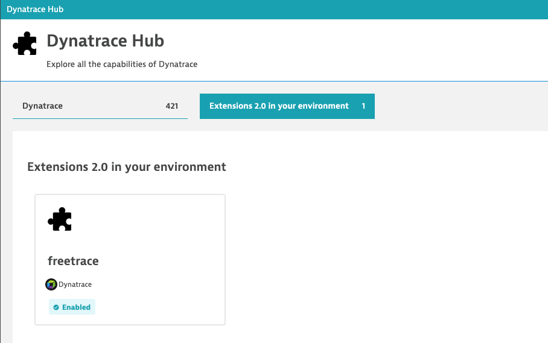

# Freetrace topology extraction example

This self-contained example explains how to set up topology extraction configurations in order to automatically extract vertical and horizontal topology 
through a multi-dimensional metric data stream.

This example contains:
- A [load generator](freetrace-demo-datagenerator.py) that sends two metrics (demo.service.requestcount and demo.service.responsetime)
- A [Dynatrace Extension 2.0 yaml](extension.yaml) file that contains all necessary declarative extraction rules to generate a dynamic service topology, as it is shown below. 

## Topology definition

The below figure shows the topology that this example is able to dynamically generate within Dynatrace. Client services are calling backend services through a 'calls' relationship. Each service runs on a process that is defined through its port, process name and host IP. The processes are running on hosts that are given by their IPs. 
Within this example three entity types are automatically extracted, that are: ftrace:service, ftrace:process and ftrace:host.


## Dynatrace Extension 2.0

To simplify the creation of those 3 different entity types along with their relationships, the newly introduced [Dynatrace Extension 2.0 framework](https://www.dynatrace.com/support/help/extend-dynatrace/extensions20/) can be used.
Just pack the extension.yaml file into a zip structure and upload it into your Dynatrace Hub, as shown below:



## Load generator

A self-contained Python script that sends two metrics with random measurements into your Dynatrace monitoring environment. 

### How to run the load generator

- Replace the API token with your own Dynatrace APIv2 access token that has the metric ingest scope enabled.
- Replace the Dynatrace API URL with your own monitoring environment domain. 
- Finally schedule this load generator Python script to run every minute by using a cron-job to receive a continous random metric stream.

See below an example of the raw dimensional metric line protocol that the load generator generates and sends every minute:

```text
demo.service.responsetime,cl_service=webserver,cl_ip=52.18.160.10,cl_port=80,cl_tech=tomcat,cl_processname=tomcat.exe,cl_jar=com.dynatrace.easytravel.pluginservice.jar,cl_path="/home/labuser/easytravel-*-x*/jre/bin/java, /home/labuser/easytravel-2.0.0-x64/jre/bin/java",srv_service=bookingService,srv_ip=52.18.160.40,srv_port=8000,srv_tech=java,srv_processname=java,response_code=200 4152
demo.service.requestcount,cl_service=webserver,cl_ip=52.18.160.10,cl_port=80,cl_tech=tomcat,cl_processname=tomcat.exe,cl_jar=com.dynatrace.easytravel.pluginservice.jar,cl_path="/home/labuser/easytravel-*-x*/jre/bin/java, /home/labuser/easytravel-2.0.0-x64/jre/bin/java",srv_service=bookingService,srv_ip=52.18.160.40,srv_port=8000,srv_tech=java,srv_processname=java,response_code=200 2
demo.service.responsetime,cl_service=bookingService,cl_ip=52.18.160.40,cl_port=8000,cl_tech=java,cl_processname=java,srv_service=authenticationService,srv_ip=52.18.160.20,srv_port=8080,srv_tech=jetty,srv_processname=java,response_code=200 21
demo.service.requestcount,cl_service=bookingService,cl_ip=52.18.160.40,cl_port=8000,cl_tech=java,cl_processname=java,srv_service=authenticationService,srv_ip=52.18.160.20,srv_port=8080,srv_tech=jetty,srv_processname=java,response_code=200 1
demo.service.responsetime,cl_service=bookingService,cl_ip=52.18.160.40,cl_port=8000,cl_tech=java,cl_processname=java,srv_service=paymentService,srv_ip=52.18.160.30,srv_port=9000,srv_tech=golang,srv_processname=payment.exe,response_code=200 231
demo.service.requestcount,cl_service=bookingService,cl_ip=52.18.160.40,cl_port=8000,cl_tech=java,cl_processname=java,srv_service=paymentService,srv_ip=52.18.160.30,srv_port=9000,srv_tech=golang,srv_processname=payment.exe,response_code=200 1
demo.service.responsetime,cl_service=paymentService,cl_ip=52.18.160.30,cl_port=9000,cl_tech=golang,cl_processname=payment.exe,srv_service=databaseService,srv_ip=52.18.160.50,srv_port=7000,srv_tech=oracle,srv_processname=oracle.exe,response_code=200 282
demo.service.requestcount,cl_service=paymentService,cl_ip=52.18.160.30,cl_port=9000,cl_tech=golang,cl_processname=payment.exe,srv_service=databaseService,srv_ip=52.18.160.50,srv_port=7000,srv_tech=oracle,srv_processname=oracle.exe,response_code=200 10
demo.service.responsetime,cl_service=bookingService,cl_ip=52.18.160.40,cl_port=8000,cl_tech=java,cl_processname=java,srv_service=databaseService,srv_ip=52.18.160.51,srv_port=7000,srv_tech=oracle,srv_processname=oracle.exe,response_code=200 391
demo.service.requestcount,cl_service=bookingService,cl_ip=52.18.160.40,cl_port=8000,cl_tech=java,cl_processname=java,srv_service=databaseService,srv_ip=52.18.160.51,srv_port=7000,srv_tech=oracle,srv_processname=oracle.exe,response_code=200 7
```
