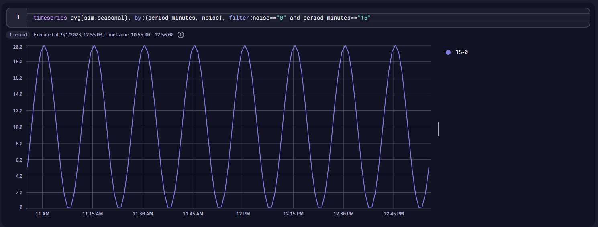

# Some Dynatrace workflows that I use for demo and testing purposes

## Metric simulator

The metric simulator is used to simulate a continous stream of metric measurements. It generates a seasonal metric with variable and configurable noise level along with variable seasonality.
Filtering by noise level or by period selects individual seasonal metrics.
It also generates simulated disk metrics that continously decrease in volume every day until the volume automatically resets at the beginning of a month.

## IoT log line simulator

The IoT log line simulator is used to produce a continous stream of log lines similar what a SCADA system would forward for an industrial machinery such as 
a conveyor belt.
It is configurable in terms of the log line templates it sends, the probabilities of each log line and the number of pumps and conveyor lines the simulator should generate logs for.

## Data volume anomaly detector

This workflow is used to observe the typical data volume for a given DQL query, produce a forecast on what volume is expected in the future and raises an event in case the current volume breaches the lower band of the predicted volume.

## Observe the data schema

This workflow is used to observe a given data schema by using DQL, counting the number of distinct field keys and writing a metric that persists this field key count over time, which can be used to alert on abnormal deviations.

## Disk capacity prediction

This workflow is used to predict resource capacities such as free disk and raise events in case the predicted free disk goes below the lower predicted band.

Get the workflow [here](./disk_prediction/) 